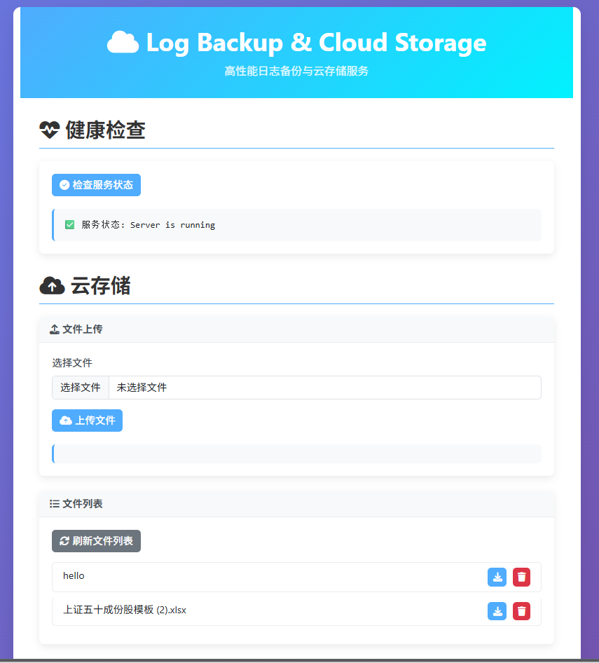

# 分布式云存储系统

## 项目简介

这是一个基于C++的分布式云存储系统，采用微服务架构设计，支持文件的上传、下载、删除和列举功能。系统具有以下特点：

- **动态节点管理**：存储节点支持动态上下线，自动更新一致性哈希环
- **负载均衡**：基于一致性哈希算法实现文件的均匀分布
- **高可用性**：使用RaftKV实现元数据的分布式存储
- **健康检查**：定期检测节点健康状态，自动移除故障节点
- **中文支持**：支持中文文件名上传和下载
- **配置化**：通过.env文件灵活配置系统参数

## 系统架构

```
┌─────────────────────────────────────────────────────────────┐
│                         客户端                               │
│                   (Web浏览器/curl)                           │
└──────────────────────┬──────────────────────────────────────┘
                       │ HTTP请求
                       ▼
┌─────────────────────────────────────────────────────────────┐
│                      网关服务 (Gateway)                      │
│  ┌──────────────┐  ┌──────────────┐  ┌──────────────┐      │
│  │  HTTP接口层   │  │ 一致性哈希    │  │ 健康检查     │      │
│  │  (libhv)     │  │ (Consistent  │  │ (HealthCheck)│      │
│  │              │  │  Hash)       │  │              │      │
│  └──────────────┘  └──────────────┘  └──────────────┘      │
│  ┌──────────────┐  ┌──────────────┐                        │
│  │ 配置管理器    │  │ KV Watch     │                        │
│  │ (ConfigMgr)  │  │ (动态发现)    │                        │
│  └──────────────┘  └──────────────┘                        │
└──────────────────────┬──────────────────────────────────────┘
                       │ RPC调用
                       ▼
┌─────────────────────────────────────────────────────────────┐
│                    存储节点集群 (Storage Nodes)              │
│  ┌──────────┐  ┌──────────┐  ┌──────────┐                  │
│  │ Node 1   │  │ Node 2   │  │ Node 3   │  ...             │
│  │ Port:8001│  │ Port:8002│  │ Port:8003│                  │
│  └──────────┘  └──────────┘  └──────────┘                  │
└──────────────────────┬──────────────────────────────────────┘
                       │ 元数据同步
                       ▼
┌─────────────────────────────────────────────────────────────┐
│                    RaftKV集群                               │
│  ┌──────────┐  ┌──────────┐  ┌──────────┐                  │
│  │ RaftNode1│  │ RaftNode2│  │ RaftNode3│                  │
│  └──────────┘  └──────────┘  └──────────┘                  │
└─────────────────────────────────────────────────────────────┘
```

## 核心组件

### 1. 网关服务 (Gateway)
- **HTTP接口**：提供RESTful API，处理客户端请求
- **一致性哈希**：实现文件到存储节点的映射
- **动态发现**：通过RaftKV的Watch机制自动发现节点上下线
- **健康检查**：定期检测节点健康状态，确保服务可靠性

### 2. 存储节点 (Storage Node)
- **文件存储**：负责文件的实际存储和读取
- **RPC服务**：提供upload_file、download_file、list_files、delete_file等方法
- **元数据管理**：将文件元数据存储到RaftKV
- **节点注册**：启动时注册到RaftKV，关闭时从RaftKV移除

### 3. RaftKV集群
- **分布式存储**：提供元数据的高可用存储
- **一致性保证**：使用Raft算法确保数据一致性
- **Watch机制**：支持监听键值变化，实现节点自动发现

## 目录结构

```
├── bin/                # 编译输出目录
├── build/              # 构建目录
├── config/             # 配置文件目录
├── include/            # 头文件目录
│   ├── log/            # 日志相关
│   └── service/        # 核心服务
├── logs/               # 日志文件目录
├── src/                # 源代码目录
│   └── log/            # 日志和服务实现
├── Test/               # 测试代码
└── third_party/        # 第三方依赖
    └── raftKV/         # RaftKV实现
```

## 配置文件

### config/gateway_config.env

```bash
# Gateway Configuration
GATEWAY_PORT=8080
GATEWAY_THREAD_NUM=4

# Storage Node Ports
STORAGE_PORTS=8001,8002

# RPC Client Configuration
RPC_MAX_RETRIES=3
RPC_RETRY_DELAY=1
```

## 快速开始

### 编译项目

```bash
# 创建构建目录
mkdir -p build && cd build

# 配置项目
cmake ..

# 编译
make -j4
```

### 启动Raft集群

需要启动至少3个Raft节点（存储节点）：

```bash
# 节点1
./bin/storage_node  1  127.0.0.1 8001 1 127.0.0.1:8002 127.0.0.1:8003  127.0.0.1:8004

# 节点2
./bin/storage_node  2  127.0.0.1 8002 1 127.0.0.1:8001 127.0.0.1:8003  127.0.0.1:8004

# 节点3
./bin/storage_node  3  127.0.0.1 8003 1 127.0.0.1:8001 127.0.0.1:8002  127.0.0.1:8004
```

### 启动网关服务

```bash
./bin/gateway 4 127.0.0.1 8004 1 127.0.0.1:8001 127.0.0.1:8002 127.0.0.1:8003
```

### 网页界面


## API文档

### HTTP接口

| 方法 | 路径 | 功能 | 参数 |
|------|------|------|------|
| GET | /health | 健康检查 | 无 |
| GET | / | 文件管理页面 | 无 |
| POST | /api/storage/upload | 文件上传 | filename: 文件名 |
| GET | /api/storage/download/{filename} | 文件下载 | filename: 文件名 |
| GET | /api/storage/list | 列举文件 | 无 |
| DELETE | /api/storage/delete/{filename} | 删除文件 | filename: 文件名 |

### RPC接口

| 方法 | 参数 | 返回值 | 功能 |
|------|------|--------|------|
| upload_file | CloudStorageMetadata, string | string | 上传文件 |
| download_file | string | string | 下载文件 |
| list_files | int | string | 列举文件 |
| delete_file | string, string | string | 删除文件 |

## 技术栈

| 组件 | 技术 | 用途 |
|------|------|------|
| HTTP服务器 | libhv | 提供HTTP接口 |
| RPC框架 | mrpc (基于Asio) | 服务间通信 |
| 分布式KV | RaftKV | 元数据存储 |
| 一致性哈希 | 自研 | 负载均衡 |
| 日志 | spdlog + 自研AsyncLogger | 日志记录 |
| JSON | nlohmann/json | 数据序列化 |
| 配置 | 自定义ConfigManager | 配置管理 |

## 动态节点管理

### 节点上线流程
1. 存储节点启动，初始化Raft节点和RPC服务
2. 存储节点注册到RaftKV：`Put("NodePort:{nodeId}", "{port}")`
3. 网关通过KV Watch机制发现新节点
4. 网关建立RPC连接并添加到一致性哈希环

### 节点下线流程
1. 存储节点关闭前，从RaftKV删除注册信息：`Del("NodePort:{nodeId}")`
2. 网关通过KV Watch机制发现节点下线
3. 网关从一致性哈希环中移除节点

### 健康检查
- 网关每30秒执行一次健康检查
- 通过RPC调用存储节点的`list_files`方法检测节点状态
- 发现离线节点自动从一致性哈希环中移除

## 性能优化

1. **连接池**：重用RPC连接，避免频繁建立连接
2. **虚拟节点**：每个物理节点对应160个虚拟节点，提高负载均衡效果
3. **内存映射**：文件下载时使用内存映射提高性能
4. **批量操作**：支持批量文件处理

## 安全性

1. **文件名验证**：对文件名进行URL解码和安全验证
2. **路径遍历防护**：防止路径遍历攻击
3. **节点认证**：存储节点注册时进行身份验证
4. **数据加密**：支持文件加密存储（预留接口）

## 部署建议

1. **生产环境**：
   - 使用至少3个存储节点，确保高可用性
   - 配置负载均衡器分发HTTP请求
   - 定期备份RaftKV数据

2. **监控**：
   - 监控节点健康状态
   - 监控存储空间使用情况
   - 监控RPC调用延迟

3. **扩展**：
   - 支持水平扩展存储节点
   - 支持添加更多网关节点

## 常见问题

### Q: 存储节点启动失败？
A: 检查Raft集群配置是否正确，确保所有节点的集群配置一致。

### Q: 中文文件名乱码？
A: 系统已经实现了URL解码功能，确保客户端使用正确的URL编码。

### Q: 文件上传后无法下载？
A: 检查存储节点是否正常运行，查看网关日志了解详细错误信息。

### Q: 节点下线后文件访问失败？
A: 系统会自动将请求路由到其他健康节点，但如果文件只存储在离线节点上，可能会导致访问失败。建议实现文件复制机制。

## 许可证

MIT License

## 联系方式

- 作者：Your Name
- 邮箱：your.email@example.com
- 项目地址：https://github.com/yourusername/distributed-storage

---

**注**：本项目为分布式存储系统原型，可根据实际需求进行扩展和定制。